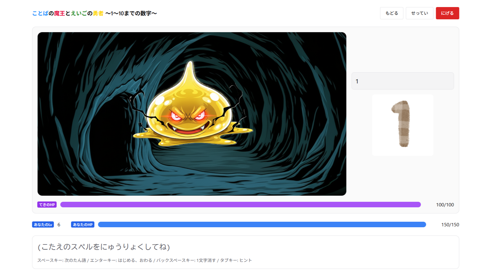
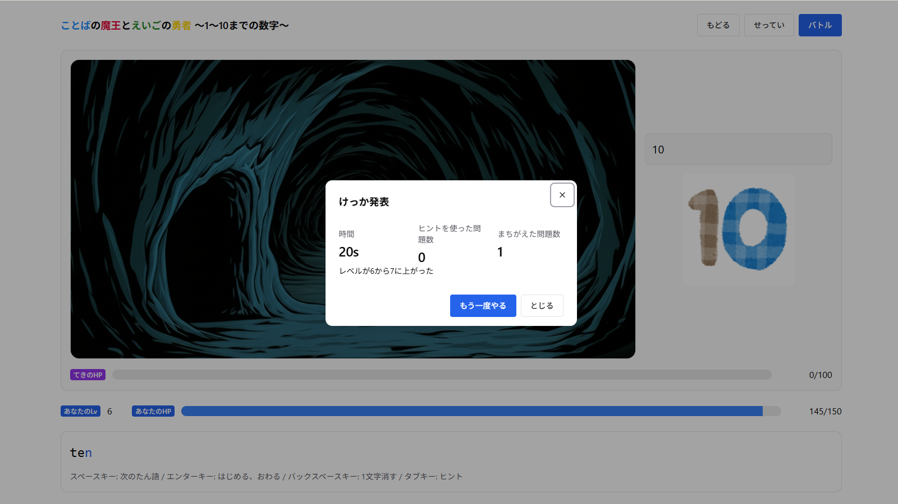
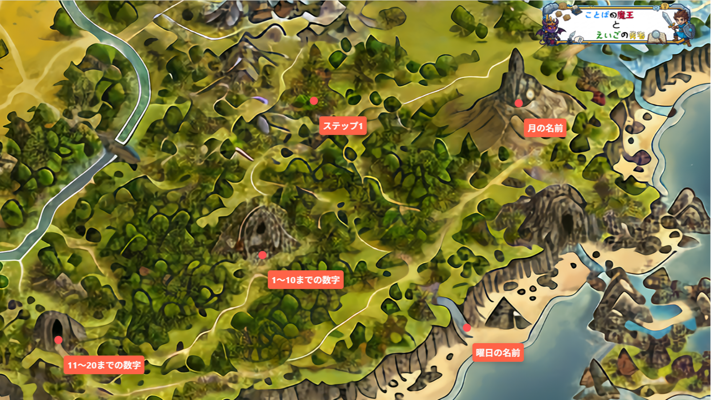

# 🧙‍♂️ ことばの魔王とえいごの勇者
*英単語で戦う、学習型タイピングRPG*

**Version:** 0.1.0
**Author:** Dr?Thomas（Yamahara Yoshihiro）

---

## 📖 概要（Overview）
「ことばの魔王とえいごの勇者」は、英単語タイピングを通して敵と戦う
教育向けのファンタジー英語学習アプリケーションです。

プレイヤーは「えいごの勇者」として、ことばの魔王を倒す旅に出ます。
学びとバトルが融合した、新しい学習体験しましょう。

---

## 💡 開発方針（Design Philosophy）
- 学び × 遊び × 挑戦 の三位一体設計
- Type-Safe & Modular を徹底した拡張性のある設計
- オフライン対応（Dexie.js）
- 子どもにも理解しやすい操作・UI設計

---

## ✨ 主な特徴（Features）
- 🎮 **タイピングバトルシステム**：英単語入力正解で攻撃
- 🧩 **マップ探索UI**：マウスドラックによる直感的な移動
- 🎧 **BGM・効果音制御**：On・Off切り替えによる音管理
- 💾 **進捗の自動保存**：ブラウザの機能によるローカル保存
- 🎨 **柔軟なUI設計**：UIライブラリとアニメーションライブラリによる動的なUI
- 📚 **ドキュメント自動生成**：コード内にコメントを記入することによりドキュメントの一部自動生成を実現 (開発者向け)
- 🧪 **単体テスト＆カバレッジ**：コードの安全性を高めるためのテスト及びカバレッジ (開発者向け)

---

## 🧰 技術スタック（Tech Stack）

| 分類 | 使用技術 |
|------|-----------|
| フロントエンド | React + TypeScript + Vite |
| UI / アニメーション | Chakra UI / Framer Motion |
| オーディオ | Howler.js |
| 永続化 | Dexie.js |
| 描画 | React-Konva |
| テスト | Vitest |
| ドキュメント | Rspress / TypeDoc / Ladle |
| Lint / Format | Biome |

---

## 📑 システム要件
必要最低限の開発要件です。
- **ブラウザ**: Google Chrome Ver 33（音声合成API対応ブラウザ）
- **Node.js**: v18（ローカル開発用）
- **OS**: Windows / macOS / Linux

---

## 📁 ディレクトリ構成（Project Structure）
```bash
typing-game/
├── .ladle/                          # Ladle コンポーネント開発ツール設定ディレクトリ
│
├── docs/                            # 公開用ビルド出力先（GitHub Pages）
│   ├── assets/                      # アセットファイル
│   ├── images/                      # 画像ファイル
│   │   ├── background/              # backgroundイメージフォルダ
│   │   ├── icon/                    # ファビコンフォルダ
│   │   ├── map/                     # 地図イメージフォルダ
│   │   ├── monster/                 # モンスターイメージフォルダ
│   │   ├── title/                   # タイトルイメージフォルダ
│   │   ├── [Problem Image Folder]/  # 問題画像フォルダ
│   │   ├── :                        #
│   │   └── :                        #
│   ├── manual/                      # Rspress 出力（マニュアル）
│   │   ├── api/                     # API ドキュメント
│   │   ├── components/              # コンポーネントフォルダ
│   │   ├── cov/                     # カバレッジルートドキュメント出力フォルダ
│   │   ├── coverage/                # カバレッジドキュメント本体フォルダ
│   │   ├── ladle/                   # コンポーネント開発ツールルートドキュメント
│   │   ├── LadleStorys/             # コンポーネント開発ツールドキュメント本体フォルダ
│   │   ├── Overview                 # ReadMeドキュメント
│   │   └── static/                  # 静的ファイルフォルダ
│   └── music/                       # 音楽ファイル
│   │   ├── bgm/                     # バックミュージックフォルダ
│   │   └── soundEffects/            # サウントエフェクトフォルダ
├── public/                          # パブリックフォルダ
│   ├── images/                      # 画像ファイル
│   │   ├── background/              # backgroundイメージフォルダ
│   │   ├── icon/                    # ファビコンフォルダ
│   │   ├── map/                     # 地図イメージフォルダ
│   │   ├── monster/                 # モンスターイメージフォルダ
│   │   ├── title/                   # タイトルイメージフォルダ
│   │   ├── [Problem Image Folder]/  # 問題画像フォルダ
│   │   ├── :                        #
│   │   └── :                        #
│   ├── music/                       # 音楽ファイル
│   │   ├── bgm/                     # バックミュージックフォルダ
│   │   └── soundEffects/            # サウントエフェクトフォルダ
│   └── readme/                      # ReadMeドキュメント使用イメージフォルダ
│
├── site/                            # Rspress ドキュメントルート
│   ├── api/                         # API ドキュメント
│   ├── components/                  # コンポーネント
│   ├── cov/                         # カバレッジルートドキュメント
│   ├── ladle/                       # コンポーネント開発ツールルートドキュメント
│   ├── Overview/                    # ReadMeドキュメント
│   └── styles/                      # スタイルシートドキュメント
│
├── src/                             # ソースコードルート
│   ├── components/                  # コンポーネント
│   │   ├── map/                     # マップ描画UI
│   │   ├── typing/                  # タイピング関連UI
│   │   │   ├── HeaderArea/          # ヘッダー領域コンポーネント
│   │   │   ├── BattleArea/          # バトル領域コンポーネント
│   │   │   ├── AnswerArea/          # 回答領域コンポーネント
│   │   │   ├── ResultsDialog/       # 結果ダイアログコンポーネント
│   │   │   └── SettingsDrawer/      # 設定ドローワコンポーネント
│   │   ├── ui/                      # Chakra UI デフォルトコンポーネント
│   │   └── visuals/                 # HPバー等表示コンポーネント
│   ├── contexts/                    # React Contexts 設定
│   ├── data/                        # ゲームデータ（単語リスト、敵データなど）
│   │   └── texts/                   # 問題設定ファイル収納フォルダ
│   ├── db/                          # Dexie.js用設定
│   ├── hooks/                       # 自作カスタムフック
│   │   ├── typingEngine/            # タイピングエンジンフック
│   │   └── typingPage/              # タイピングページフック
│   ├── lib/                         # 汎用ユーティリティ
│   ├── Pages/                       # ページコンポーネント
│   ├── repositories/                # Dexie.js使用関数保存フォルダ
│   ├── stories/                     # Ladle コンポーネント開発ツール
│   │   └── components/              # UIコンポーネントのデモ
│   │       └── typing/              # タイピングゲームのUIコンポーネントのデモ
│   ├── types/                       # 型定義ファイル
│   ├── App.tsx                      # 全体構成ファイル
│   └── main.tsx                     # アプリエントリポイントファイル
│
├── tests/                           # テストコード
│   ├── __mocks__/                   # モックデータやモック関数を定義
│   ├── custom/                      # カスタムcss
│   ├── hooks/                       # カスタムフックのテストスクリプト
│   │   ├── typingEngine/            # タイピングエンジンフックテストスクリプト
│   │   └── typingPage/              # タイピングページフックテストスクリプト
│   ├── lib/                         # テスト用ライブラリ
│   ├── setup/                       # テスト用セットアップ
│   ├── ui/                          # テスト用UIコンポーネントのデモ
│   │   ├── ResultsDialog/           # テスト用ResultsDialogコンポーネントのデモ
│   │   └── SettingsDrawer/          # テスト用SettingsDrawerコンポーネントのデモ
│   └── utils/                       # Providersの設定
│
├── biome.json                       # Biome用 Linter / Formatter 設定
├── index.html                       # index.html
├── package.json                     # npmスクリプト・依存関係
├── rspress.config.ts                # Rspress ドキュメント設定
├── README.md                        # プロジェクト概要
├── LICENSE.md                       # ライセンス文書
├── LICENSE.EN.md                    # ライセンス文書 (English)
├── tsconfig.json                    # 全体用 TypeScript 設定
├── tsconfig.app.json                # アプリ用 TypeScript 設定
├── tsconfig.node.json               # node用 TypeScript 設定
├── tsconfig.site.json               # Rspress 用 TypeScript 設定
├── tsconfig.tests.json              # tests 用 TypeScript 設定
├── typedoc.json                     # typedoc 用設定
├── vite.config.ts                   # Vite 設定
├── vitest.config.ts                 # テスト環境全体の設定ファイル
└── vitest.setup.ts                  # テスト実行前の初期化スクリプト
```

---

## ⚙️ セットアップ手順（Setup）
以下の手順で行なってください。
```bash
git clone https://github.com/yourname/typing-rpg.git
cd typing-rpg
npm install
npm run dev
```

---

## 🧪 スクリプト一覧（Available Scripts）

| コマンド | 説明 |
|-----------|------|
| `npm run dev` | 開発サーバー起動 |
| `npm run build` | 本番ビルド |
| `npm run preview` | 本番ビルドしたアプリをローカルでプレビュー |
| `npm run format` | コードフォーマット |
| `npm run lint` | コードの lint |
| `npm run ladle` | テスト実行 |
| `npm run ladle:build` | テストビルド |
| `npm run ladle:preview` | テストプレビュー |
| `npm run test` | テスト実行(ウォッチモード) |
| `npm run test:run` | テスト実行(一度だけテストを実行して終了) |
| `npm run test:cov` | テスト実行&カバレッジレポート出力 |
| `npm run docs:build` | APIドキュメント出力 |
| `npm run docs:check` | TSDoc形式の表記チェック |
| `npm run site:dev` | Rspress ドキュメント起動 |
| `npm run site:build` | Rspress ドキュメントビルド |
| `npm run site:preview` | Rspress ドキュメントプレビュー |

---

## 🖼️ スクリーンショット例（Screenshots）

<table style="table-layout: fixed; width: 100%;">
  <colgroup>
    <col style="width: 33%;">
    <col style="width: 33%;">
    <col style="width: 33%;">
  </colgroup>
  <tr>
    <th>バトル画面</th>
    <th>結果画面</th>
    <th>マップ画面</th>
  </tr>
  <tr>
    <td></td>
    <td></td>
    <td></td>
  </tr>
</table>

---

## 🗺️ 今後のロードマップ（Roadmap）
1. [ ] **弱点復習モード**
   - Dexieで間違えた単語を記録
   - 「復習リスト」から再戦できるUI

1. [ ] **ステージ別単語セット**
   - 難易度・学年別などで分類
   - Progressバー表示で進行感を演出

1. [ ] **成績・履歴グラフ**
   - 正答率／WPM／クリア数を可視化
   - Chakra + Rechartsで簡易グラフを導入

1. [ ] **デイリーチャレンジ**
   - 1日1問 or 1ステージ挑戦可
   - データに「最終プレイ日」を保存

1. [ ] **ナレーション・導入ストーリー**
   - 各ステージ開始時に簡単なセリフや字幕
   - 教育ストーリーを自然に挿入

---

## 📄 ライセンス（License）

**短縮版：**
> © 2025 Dr?Thomas（こと Yamahara Yoshihiro）
> 個人利用は自由、商用利用・公開時は要連絡および原作者表記必須。
> 改変は公開しない限り自由に行えます。

**詳細は [LICENSE.md](./LICENSE.md) を参照してください。**

本アプリ内の画像は[いらすとや](https://www.irasutoya.com/)より提供されています。

ここで使用されているモンスター及び背景画像は[Gemini](https://gemini.google.com/)を用いて作成されました。

本アプリ内の効果音は[効果音ラボ](https://soundeffect-lab.info/)、[OtoLogic](https://otologic.jp/)、[ポケットサウンド/効果音素材](https://pocket-se.info/)より提供されています。

---

## 👤 作者情報（Author & Links）

- 🧑‍💻 **作者:** Yamahara Yoshihiro
- 🌐 **Website:** [https://www.hobofoto.work](https://www.hobofoto.work)
- 📖 **Docs:** [https://drthomas246.github.io/typing-game/manual/](https://drthomas246.github.io/typing-game/manual/)
- 🎮 **Demo:** [https://drthomas246.github.io/typing-game/](https://drthomas246.github.io/typing-game/)
