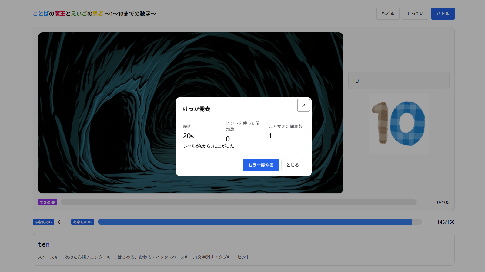

<table style="table-layout: fixed; width: 100%;">
  <colgroup>
    <col style="width: 33%;">
    <col style="width: 33%;">
    <col style="width: 33%;">
  </colgroup>
  <tr>
    <th>バトル画面</th>
    <th>結果画面</th>
    <th>マップ画面</th>
  </tr>
  <tr>
    <td></td>
    <td></td>
    <td></td>
  </tr>
</table>
